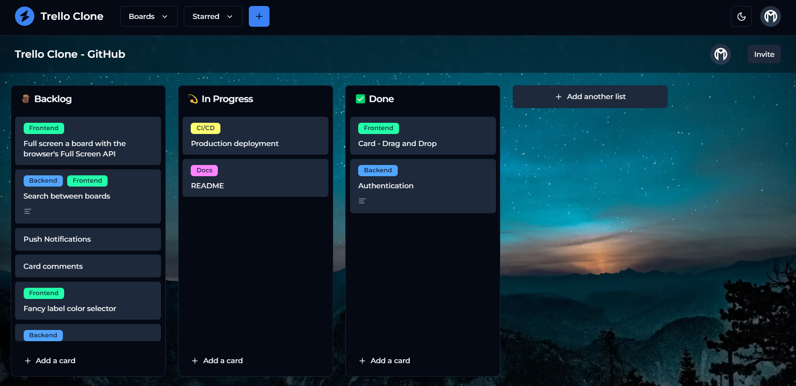

# Trello Clone

An open source Trello Clone built with everything new in the [Next.js 13](https://github.com/vercel/next.js) ecosystem.



> **Warning**  
> This project is still under development, so it's not production ready. As such, it lacks certain features and may contain annoying bugs.
>
> Also, it uses experimental technologies, such as Next.js server actions.

<hr />

## Tech Stack

- Language: [TypeScript](https://www.typescriptlang.org/)
- Framework: [React](https://react.dev/), [Next.js](https://nextjs.org/)
- Styles: [TailwindCSS](https://tailwindcss.com/)
- UI Components: [shadcn/ui](https://ui.shadcn.com/)
- ORM: [Prisma](https://www.prisma.io/)
- Authentication: [NextAuth](https://next-auth.js.org/)
- Testing: [Cypress](https://www.cypress.io/)
- Validation: [zod](https://zod.dev/)
- Forms: [react-hook-form](https://react-hook-form.com/)
- WYSIWYG: [Tiptap](https://tiptap.dev/)
- Primitives: [RadixUI](https://www.radix-ui.com/)
- Icons: [Lucide](https://lucide.dev/icons/)
- DND: [react-beautiful-dnd](https://github.com/atlassian/react-beautiful-dnd)
- Formatting: [Prettier](https://prettier.io/)
- Background Images: [Unsplash](https://unsplash.com/)
- Illustrations: [storyset](https://storyset.com/)

## Current Features

- Authentication
  - Log In, Registration
- Dashboard
- Light and Dark UI theme
- Boards
  - Private, public
  - Background Images from unsplash
  - Create lists
- Cards
  - Cards inside lists
  - Labels: CRUD
  - Card description with WYSIWYG editor
  - Drag-and-drop functionality amongst the boards
- Profile
  - Change password

## Contributing

**Contributions are more than welcome!** Please open an issue if you have any questions or suggestions. See the [contributing guide](./CONTRIBUTING.md) for more information.

## Running Locally

```sh
# Clone the project:
git clone https://github.com/0l1v3rr/trello-clone.git
cd trello-clone

# Copy the .env.example file and rename it to .env
# Also, make the appropriate changes
cp .env.example .env

# Run the database with docker:
docker compose up -d

# Install the dependencies:
npm i
npm run prepare

# Migrate the DB (and optionally seed it)
npx prisma migrate dev
npm run seed

# Run the application:
npm run dev
```

## License

This project is licensed under the [MIT License](./LICENSE).
